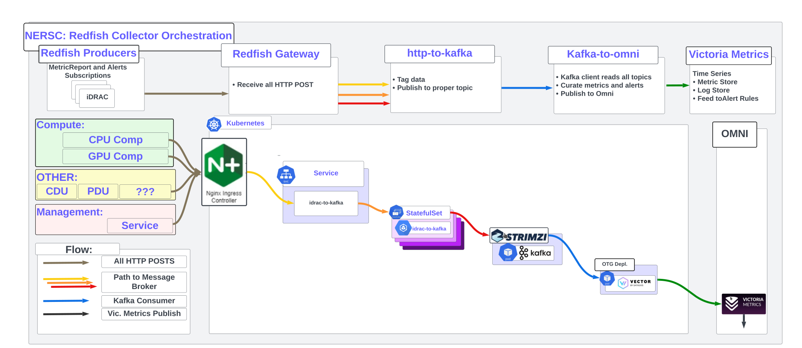

Abstract
---

Contains things to install strimzi-kafka-operator, nginx-ingress-controler, and idrac-to-kafka

Pipeline
---



Dirs
---
```console
charts:       Contains local charts
values:       Contains chart override values
helmfile.yaml List of charts to install 
oci:          Build the image used by idrac-to-kafka
```

Prepare host environemnt:
---

```console
#
# Setup minikube
#
curl -LO https://storage.googleapis.com/minikube/releases/latest/minikube-linux-amd64
sudo install minikube-linux-amd64 /usr/local/bin/minikube && rm minikube-linux-amd64
#
# Give your user permission (replace demouser)
#
sudo cat >> /etc/sudoers.d/podman<'EOF'
demouser ALL=(ALL) NOPASSWD: /usr/bin/podman
EOF
#
# Start minicube
#
minikube start --driver=podman

  😄  minikube v1.36.0 on Ubuntu 24.04
  ✨  Using the podman driver based on user configuration
  📌  Using Podman driver with root privileges
  👍  Starting "minikube" primary control-plane node in "minikube" cluster
  🚜  Pulling base image v0.0.47 ...
  💾  Downloading Kubernetes v1.33.1 preload ...
      > preloaded-images-k8s-v18-v1...:  347.04 MiB / 347.04 MiB  100.00% 3.11 Mi
      > gcr.io/k8s-minikube/kicbase...:  502.26 MiB / 502.26 MiB  100.00% 2.73 Mi
  E0807 12:57:34.605470  301185 cache.go:225] Error downloading kic artifacts:  not yet implemented, see issue #8426
  🔥  Creating podman container (CPUs=2, Memory=5900MB) .../
  
  🐳  Preparing Kubernetes v1.33.1 on Docker 28.1.1 ...
      ▪ Generating certificates and keys ...
      ▪ Booting up control plane ...
      ▪ Configuring RBAC rules ...
  🔗  Configuring bridge CNI (Container Networking Interface) ...
  🔎  Verifying Kubernetes components...
      ▪ Using image gcr.io/k8s-minikube/storage-provisioner:v5
  🌟  Enabled addons: storage-provisioner, default-storageclass
  
  ❗  /usr/bin/kubectl is version 1.20.5, which may have incompatibilities with Kubernetes 1.33.1.
      ▪ Want kubectl v1.33.1? Try 'minikube kubectl -- get pods -A'
  🏄  Done! kubectl is now configured to use "minikube" cluster and "default" namespace by default
#
# We need an external ip address, so `minikube tunnel` must run in a seperate console
#
minikube tunnel
  Status:
        machine: minikube
        pid: 1834165
        route: 10.96.0.0/12 -> 192.168.49.2
        minikube: Running
        services: [ingress-nginx-controller]
    errors: 
                minikube: no errors
                router: no errors
                loadbalancer emulator: no errors
#  
# Test api
#  
kubectl  get nodes
  NAME       STATUS   ROLES           AGE     VERSION
  minikube   Ready    control-plane   2m26s   v1.33.1
#
# Setup kubectl tab completion for bash
#
echo 'source <(kubectl completion bash)' >> ~/.bashrc
source ~/.bashrc
#
# Install helmfile 
#
curl -sLk -o helmfile  https://github.com/roboll/helmfile/releases/download/v0.144.0/helmfile_linux_amd64 
chmod +x helmfile
#
# Install Helm (Need reliable helm >= 3.7.0)
#
curl -fsSL -o helm.tar.gz https://get.helm.sh/helm-v3.13.3-linux-amd64.tar.gz
tar -xzvf helm.tar.gz
HELM="./linux-amd64/helm"
echo "Using Helm verison: $($HELM version)"

  Using Helm verison: version.BuildInfo{Version:"v3.13.3", GitCommit:"c8b948945e52abba22ff885446a1486cb5fd3474", GitTreeState:"clean", GoVersion:"go1.20.11"}
```

Build OCI Image for idrac-to-kafka
---

This script will build the image for the idrac-to-kafka chart, push to the registry, and update the charts values override file.

1. Change the IMG_REGISTRY in build_and_publish.bash
2. Run the scirpt build_and_publish.bash

```console
pushd oci
./build_and_publish.bash
popd
```

Image Pull Token
---

If the idrac-to-kafka contianer image is pulled from a registry that requires authentication, create a k8s Secrets, and define imagePullSecretsOption.

```console
#
# Example Secret in the same namespace where idrac-to-kafka will be installed.
#
kubectl -n telem  get secrets registry-pull-token 
NAME                     TYPE                             DATA   AGE
registry-pull-token   kubernetes.io/dockerconfigjson   1      81d
#
# This is an example imagePullSecretsOption in the vaules file for the idrac-to-kafka chart
#
cat values/idrac-to-kafka.yaml 
---
imagePullSecretsOption:
  imagePullSecrets:
  - name: registry-pull-token
```

Configure the version of ingress-nginx in helmfile.yaml 
---

1. Find a version of Ingress-NGINX helm chart compatible with your kubernetes server API version

    [Verson compatability table](https://github.com/kubernetes/ingress-nginx?tab=readme-ov-file#supported-versions-table)

    NOTE: When Ingress-NGINX is not compatible, it will not start

```console
#
# This shows a kubernetes server API at version v1.33.1
#
kubectl  version
  Client Version: version.Info{Major:"1", Minor:"20", GitVersion:"v1.20.5", GitCommit:"6b1d87acf3c8253c123756b9e61dac642678305f", GitTreeState:"clean", BuildDate:"2021-03-18T01:10:43Z", GoVersion:"go1.15.8", Compiler:"gc", Platform:"linux/amd64"}
  Server Version: version.Info{Major:"1", Minor:"33", GitVersion:"v1.33.1", GitCommit:"8adc0f041b8e7ad1d30e29cc59c6ae7a15e19828", GitTreeState:"clean", BuildDate:"2025-05-15T08:19:08Z", GoVersion:"go1.24.2", Compiler:"gc", Platform:"linux/amd64"}

e.g. Example compatability
#
# Dell OMNI has kubernetes-v1.26.12, which is compatible with nginx-1.11.5 (not 1.12.1)
#
  Ingress-NGINX  k8s supported ver:             Alpine Ver:   Nginx Ver:  Helm Chart Ver:
  v1.12.1        1.32, 1.31, 1.30, 1.29, 1.28   3.21.3        1.25.5      4.12.1
  v1.11.5        1.30, 1.29, 1.28, 1.27, 1.26   3.21.3        1.25.5      4.11.5
#
# My development system has kubernetes-v1.33, which is compatible with nginx-v1.13.0
#
  Ingress-NGINX  k8s supported ver:             Alpine Ver:   Nginx Ver:  Helm Chart Ver:
  v1.13.0        1.33, 1.32, 1.31, 1.30, 1.29   3.22.0        1.27.1      4.13.0
```

2. Edit the Ingress-NGINX chart version

```console
vi helmfile.yaml

  releases:
    - name: ingress-nginx
      namespace: ingress-nginx
      chart: ingress-nginx/ingress-nginx
      version: 4.13.0                    <<== CHANGE HERE
```

Install Chars with helmfile
---

A helmfile project consist of:
  1. A helmfile.yaml listing all the charts
  2. A values directory, containing a values override file for each chart (files name matches each chart name)

The helmfile command will install/uninstall each chart, one by one.

```console
#
# Install
#
HELM="./linux-amd64/helm"
./helmfile --helm-binary $HELM -f helmfile.yaml sync
#
# Uninstall
#
./helmfile --helm-binary $HELM -f helmfile.yaml delete
```

Verify
---

```console
#
# The ingress-nginx should be running
#
kubectl  -n ingress-nginx get pods -o wide
  NAME                                        READY   STATUS    RESTARTS   AGE   IP             NODE       NOMINATED NODE   READINESS GATES
  ingress-nginx-controller-747d6dcb95-jkcj2   1/1     Running   0          66m   10.244.0.121   minikube   <none>           <none>
#
# Inbound connections enter via the ingess service EXTERNAL-IP (if EXTERNAL-IP is <pending>, minikube tunnel is not running)
#
kubectl -n ingress-nginx get svc -o wide
  NAME                                 TYPE           CLUSTER-IP       EXTERNAL-IP      PORT(S)                      AGE   SELECTOR
  ingress-nginx-controller             LoadBalancer   10.100.163.216   10.100.163.216   80:32266/TCP,443:31109/TCP   14h   app.kubernetes.io/component=controller,app.kubernetes.io/instance=ingress-nginx,app.kubernetes.io/name=ingress-nginx
  ingress-nginx-controller-admission   ClusterIP      10.97.55.136     <none>           443/TCP                      14h   app.kubernetes.io/component=controller,app.kubernetes.io/instance=ingress-nginx,app.kubernetes.io/name=ingress-nginx
  ingress-nginx-controller-metrics     ClusterIP      10.102.124.223   <none>           10254/TCP                    14h   app.kubernetes.io/component=controller,app.kubernetes.io/instance=ingress-nginx,app.kubernetes.io/name=ingress-nginx
#
# The Ingress CRD in the telem namespace advertizes the idrac-to-kafka service to the ingress-nginx-controller
#
kubectl -n telem get Ingress
  NAME                     CLASS   HOSTS   ADDRESS   PORTS     AGE
  ingress-idrac-to-kafka   nginx   *                 80, 443   28s
#
# The idrac-to-kafka Service sends traffic to the idrac-to-kafka Pod
#
kubectl  -n telem  get svc -o wide
  NAME             TYPE        CLUSTER-IP       EXTERNAL-IP   PORT(S)    AGE    SELECTOR
  idrac-to-kafka   ClusterIP   10.101.105.201   <none>        8080/TCP   3m9s   app=idrac-to-kafka
#
# The idrac-to-kafka pods will receive the request 
#
kubectl  -n telem  get pods -o wide |grep idrac-to-kafka
  idrac-to-kafka-0                            1/1     Running   0          4m37s   10.244.0.118   minikube   <none>           <none>
#
# You will see logs 
#
kubectl  -n telem logs -f idrac-to-kafka-0
#
# NOTE: This configuration uses host-based ingress, so one most specify the name in the query or setup name resolution
#
# This is an example of addin the host target in the curl request
#
curl -sLk http://10.109.182.140:8080 -H 'Host: idrac-to-kafka'
  {"response":"This is a test"}
#
# We are doing host based ingress, so add mapping to the ingress IP for our app
#
sudo bash -c 'echo '10.109.182.140 idrac-to-kafka' >> /etc/hosts'
#
curl -sLk http://idrac-to-kafka/
  {"response":"This is a test"}
```

Debugging
---

```console
# show helm chart default value.yaml for hints on configuraiton
helm show values ingress-nginx/ingress-nginx  |less
```

Scripting
---

Tail a kafka topic (eg. events, metricreports, nersc-ldms)

```console
kubectl -n telem exec -i cluster-broker-4 -- /opt/kafka/bin/kafka-console-consumer.sh --bootstrap-server localhost:9092 --topic <YOUR_TOPIC>
```

List kafka topics
```
kubectl  -n telem exec -it cluster-broker-4 -- /bin/bash -c "/opt/kafka/bin/kafka-topics.sh  --bootstrap-server localhost:9092 --list"
```


